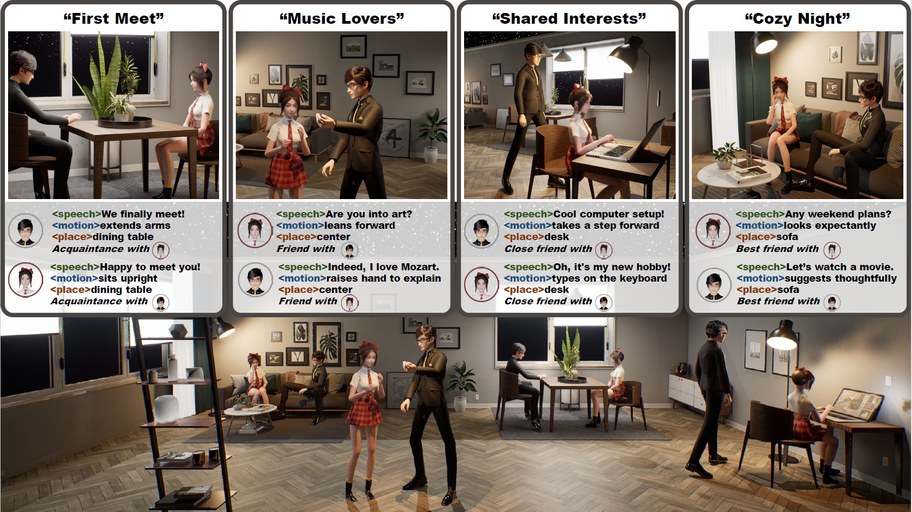

# Digital Life Project 



<div align="center">
    <b>Digital Life Project: Autonomous 3D Characters with Social Intelligence</b> 
    <br/>
    <a href="https://digital-life-project.com/" class="button"><b>[Homepage]</b></a> &nbsp;&nbsp;&nbsp;&nbsp;
    <a href="https://arxiv.org/abs/2312.04547" class="button"><b>[arXiv]</b></a> &nbsp;&nbsp;&nbsp;&nbsp;
    <a href="https://www.youtube.com/watch?v=rj0QEdGbSMs" class="button"><b>[Video]</b></a> &nbsp;&nbsp;&nbsp;&nbsp;
</div>

## News
- [2024-06-19] We released the [SocioMind](https://github.com/AlanJiang98/DLP-SocioMind).
- [2024-06-19] We presented Digital Life Project at CVPR 2024.

## Directory

We release key component code and models to facilitate future research. 

|   Component    |    Status    |                                                                           Description                                                                           |  
|:--------------:|:------------:|:---------------------------------------------------------------------------------------------------------------------------------------------------------------:|
| Overall System | Proprietary  |                                                                          Not released.                                                                          |
|   SocioMind    | Open-source  |                                     The code is released at [DLP-SocioMind](https://github.com/AlanJiang98/DLP-SocioMind).                                      |
|     MoMat      | Proprietary  |                                                                          Not released.                                                                          |
|     MoGen      | Open-source  |                                              We will release the MoGen with a simplified motion retrieval module.                                               |      
|   DLP-MoCap    | Proprietary  | [WHAC-A-Mole](https://wqyin.github.io/projects/WHAC/#whac-a-mole) contains videos synthesized with DLP-MoCap data. <br/> The MoCap data itself is not released. |  

## Related Works

Our previous works below form the foundation of the Digital Life Project.
- [Story-to-Motion](https://story2motion.github.io/): Infinite Motion Synthesis from Long Text -> MoMat
- [ReMoDiffuse](https://mingyuan-zhang.github.io/projects/ReMoDiffuse.html): Retrieval-Augmented Motion Generation -> MoGen
- [SMPLer-X](https://caizhongang.github.io/projects/SMPLer-X/): Monocular Motion Capture Foundation Model -> MoCap

## Citation
```
@InProceedings{Cai_2024_CVPR,
    author    = {Cai, Zhongang and Jiang, Jianping and Qing, Zhongfei and Guo, Xinying and Zhang, Mingyuan and Lin, Zhengyu and Mei, Haiyi and Wei, Chen and Wang, Ruisi and Yin, Wanqi and Pan, Liang and Fan, Xiangyu and Du, Han and Gao, Peng and Yang, Zhitao and Gao, Yang and Li, Jiaqi and Ren, Tianxiang and Wei, Yukun and Wang, Xiaogang and Loy, Chen Change and Yang, Lei and Liu, Ziwei},
    title     = {Digital Life Project: Autonomous 3D Characters with Social Intelligence},
    booktitle = {Proceedings of the IEEE/CVF Conference on Computer Vision and Pattern Recognition (CVPR)},
    month     = {June},
    year      = {2024},
    pages     = {582-592}
}
```